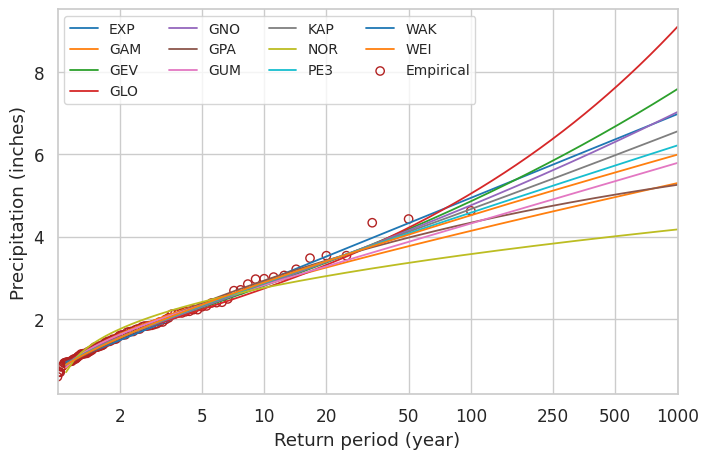
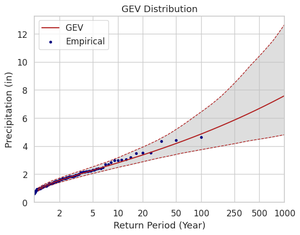

# Extreme Value Analysis

  This beginner's guide provides comprehensive instructions for performing Extreme Value Analysis (EVA), a crucial technique in statistical hydrology and climatology. It serves as an updated version of a previous repository by [royalosyin](https://github.com/royalosyin/A-Beginner-Guide-to-Carry-out-Extreme-Value-Analysis-with-Codes-in-Python), ensuring compatibility with Python3 and lmoments3. All the credits shall go to [him](https://github.com/royalosyin/A-Beginner-Guide-to-Carry-out-Extreme-Value-Analysis-with-Codes-in-Python).

Whether you are interested in extreme rainfall analysis or working with other climatic variables such as temperature and wind speed, this guide equips you with the knowledge and code examples needed for your EVA endeavors.

## Examples
<figure style="text-align: center;">
Among the functionalities, it is possible to adapt the data to different extreme distributions:

As well as calculating confidence intervals for a given distribution:

</figure>

## Modules

`lmoments3` can be installed by:
* `pip install lmoments3`